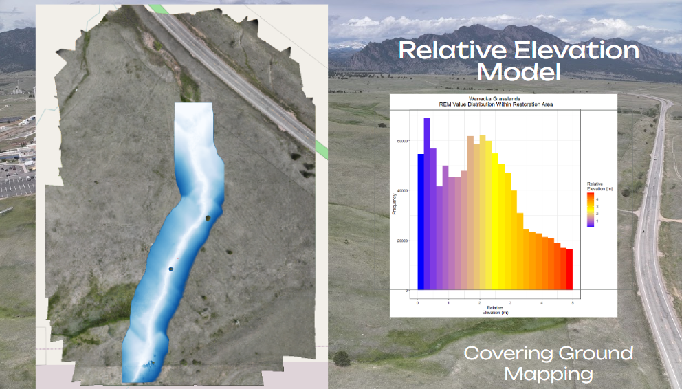
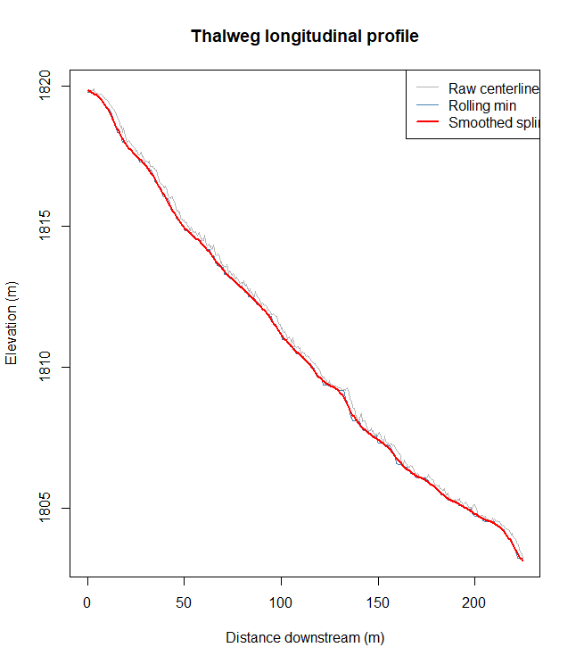
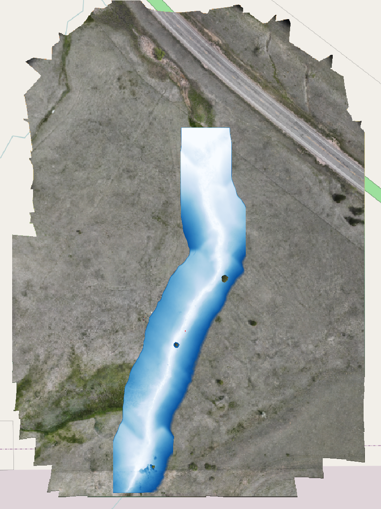
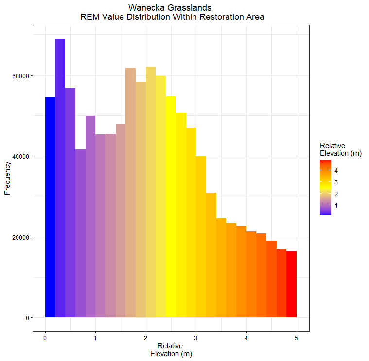

[README.md](https://github.com/user-attachments/files/28888845/README.md)




# Relative Elevation Model (REM) Workflow

This repository contains an R workflow for generating a Relative Elevation
Model (REM) from a high-resolution drone-derived Digital Surface Model (DSM)
and a channel centerline.

## Overview

The REM represents the elevation of the land surface relative to the channel
water surface / thalweg, making it easier to visualize floodplain
topography, terraces, and channel geomorphology independent of overall
valley slope.

**Method:** Centerline-based sampling → artifact filtering → rolling minimum
→ spline smoothing → nearest-station reference surface → Gaussian smoothing
→ raster subtraction.

## Requirements

- R (>= 4.0)
- Packages: `terra`, `sf`, `zoo`

```r
install.packages(c("terra", "sf", "zoo"))
```

## Inputs

- **DSM**: GeoTIFF, drone-derived (tested at 5cm resolution)
- **Centerline**: Shapefile, single or multi-segment line representing the
  channel thalweg/centerline

## Workflow Steps

1. Load DSM and centerline, align CRS, merge centerline to single line
2. Sample DSM elevation densely along the centerline
3. Filter elevation spikes (water surface artifacts, debris, boulders)
4. Apply rolling minimum to pull profile to the true channel bed
5. Smooth the longitudinal profile with a spline
6. Build a reference surface by assigning each DSM cell the smoothed
   elevation of its nearest centerline station
7. Smooth the reference surface (Gaussian) to remove blocky propagation
   artifacts
8. Compute REM = DSM − reference surface

## Key Parameters

| Parameter | Description | Notes |
|---|---|---|
| `sample_spacing` | Distance between centerline sample points (m) | ~10x DSM resolution is a good start |
| `vert_tolerance` | Max elevation deviation allowed from local median (m) | Tighten if spikes remain |
| `roll_window_m` | Rolling minimum window length (m) | Should be ≥ widest channel section |
| `spline_spar` | Spline smoothing factor (0–1) | Increase if profile is noisy |
| `smooth_sigma` | Gaussian smoothing radius for reference surface (m) | Increase if sharp edges remain in REM |

## Quality Control

The script includes a diagnostic plot of the longitudinal thalweg profile
(raw, rolling minimum, and smoothed) — review this before proceeding to
ensure the smoothing parameters are appropriate for your site.

### Example: Longitudinal Profile QC

<!-- Add screenshot of the thalweg profile plot here -->


### Example: Final REM Output

<!-- Add screenshot of the final REM map here -->


## Optional: Polygon Extraction & Histogram

A separate chunk at the end of the script extracts REM values within a
user-provided polygon and plots a histogram of the value distribution,
along with mean/median summary statistics. Useful for comparing relative
elevation distributions across reaches, habitat patches, or geomorphic
units.




## Notes

- Designed for high-resolution (≤10cm) drone DSMs with variable channel
  width
- Avoids IDW interpolation, which performs poorly on sinuous channels and
  very large rasters
- The nearest-station + Gaussian smoothing approach respects channel
  sinuosity while avoiding sharp Voronoi-style boundaries in the reference
  surface
